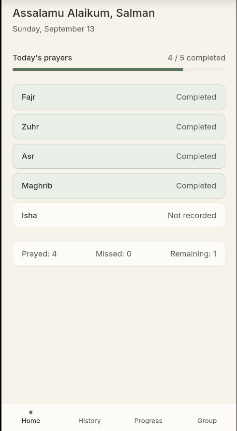
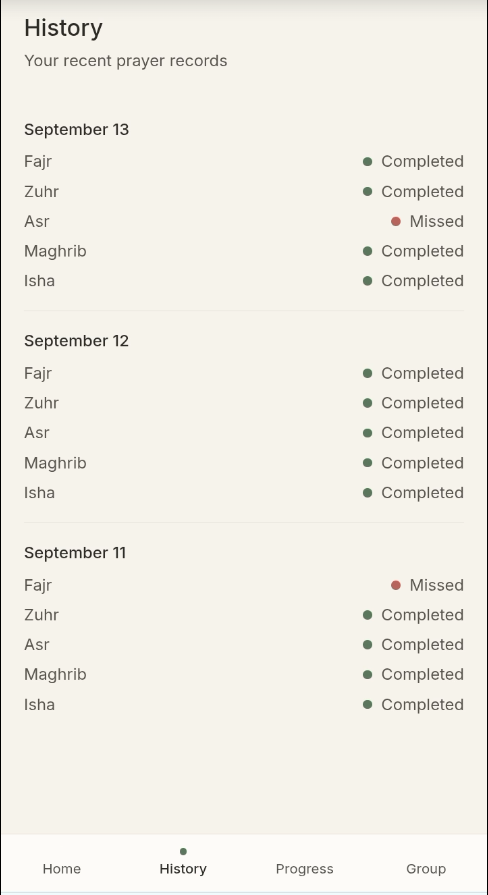
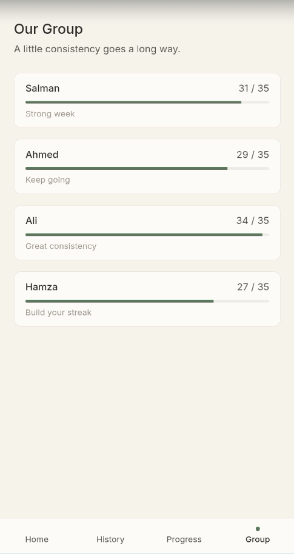

# Salah Diary

A minimal, private prayer-tracking app built for a small group of friends
to log their five daily prayers and see their progress, individually and
as a group, without any of the clutter of a typical habit tracker.


---

## Screenshots


| Dashboard | History | Group Progress |
|---|---|---|
|  |  |  |


---

## What it does

- Log all five daily prayers, Fajr, Zuhr, Asr, Maghrib, and Isha, with a single tap.
- Cycle each prayer between Not recorded, Completed, and Missed.
- Review full history, day by day.
- Track weekly streaks and per-prayer consistency.
- See the whole group's progress side by side, with encouragement rather than rankings.

## Screens

Splash, then Person selection, then PIN entry, then Dashboard for today's
prayers. History, My Progress, and Group Progress are reachable from the
nav, a bottom nav on mobile and a compact top nav on desktop.

## Design notes

Warm cream background, charcoal text, and a muted sage-green accent for
completed prayers, muted rose for missed, and neutral gray for unrecorded.
No decorative icons, no heavy shadows or gradients. Motion is kept short
and intentional, with fades and small slides between 150 and 400 milliseconds.

---

## Stack

- **Frontend:** React, Vite, Tailwind CSS
- **Backend:** Supabase (PostgreSQL), accessed via `src/lib/api.js`
- **Auth:** Lightweight name and PIN flow, verified through a Postgres function
- **Hosting:** Vercel

## Getting started

```bash
npm install
npm run dev
```

The app runs on mock data in `src/data/mockData.js` out of the box, so the
full UI is browsable with no setup. To connect it to a real database:

1. Create a Supabase project.
2. Run `supabase/schema.sql` in the Supabase SQL editor. It creates the
   `people` and `prayer_logs` tables plus the PIN-verification function.
3. Copy `.env.example` to `.env` and add your Supabase project URL and
   publishable key.
4. Restart the dev server. Logging in now creates and reads real records.

## Environment variables

| Variable | Description |
|---|---|
| `VITE_SUPABASE_URL` | Your Supabase project URL |
| `VITE_SUPABASE_ANON_KEY` | Your Supabase publishable (anon) key, safe for the browser |

## Deployment

Deployed on Vercel. Set the same two environment variables in the
project's Vercel settings, then deploy. Vercel auto-detects the Vite build.

---

A small, private tool built for a small, private group of friends trying to
stay consistent, together.